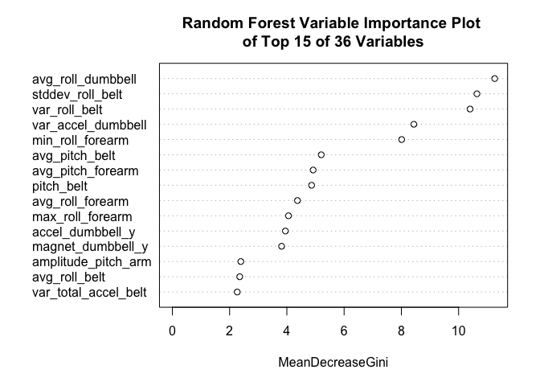
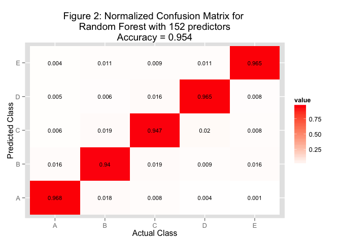

# Qualitative Activity Recognition of Weight Lifting Exercises Data
Telvis Calhoun  
March 17, 2016  

## Executive Summary

Veloso et. al. [1] developed a technique to detect how well a user performs a particular exercise. The authors propose a model-based solution that learns from biometric sensor data. They trained a model on 5 classes: class 'A' represents the “correct” technique for an exercise and classes B, C, D and E represent 4 “incorrect” methods of performing the technique. The goal is to develop an application that provides feedback to a user while performing a exercise, in order to reduce gym-related injuries due to incorrect technique.

In this project, we use `R` to build a classifier using the sensor data generously shared by the authors of this paper. The data consists of *training* set containing over 19000 samples, each with 152 variables and `classe` outcome variable with the value 'A', 'B', 'C', 'D' or 'E'. The *testing* set consists of 20 samples without the `classe` outcome variable. The goal is to build a classifier using the *training* data to predict the `classe` of the *testing* data.

### TL;DR

In a nutshell, here's a summary of the analysis performed this paper.

1. Clean the *training* data by removing `6` sensor data columns with all missing (NA) data.
2. Perform feature selection using a random forest to find the most important features.
3. Impute missing values in the cleaned *training* data using a random forest impute function.
4. Split the *training* data into a 75%/25% train/test split. Then we build several random forest models using the train split and measure accuracy using the test split. The best model has `95.8%` accuracy with *36* features.   
5. Clean the *testing* data by imputing the missing (NA) data using column medians from the training data.
6. Predict the *classe* for the 20 test samples using the best random forest model.

## Data Cleaning


First, we explore the *training* data to look for missing (NA) sensor measurements. We assume that the values: `"NA"`, `""` (empty string) and `"#DIV/0!"` represent missing sensor measurements. `Table 1` summarizes our findings. We remove the 6 sensor data columns that have all missing (NA) values. We also found that 19405 samples have at least 1 missing measurement. During model selection, we impute these missing measurements prior to building a classifier.


Table: Table 1: pml_training.csv Summary

                                                    value
-------------------------------------------------  ------
total_variables_containing_measurement_data           152
total_variables_all_missing                             6
total_rows                                          19622
total_rows_with_at_least_one_missing_measurement    19405

## Feature Selection
We calculate feature importance using the [varImp function provided by the randomForest R package](http://www.inside-r.org/packages/cran/randomforest/docs/importance). First, we build a random forest model on the entire *training* set. Then we extract the variable importance data from the model. `Figure 1` shows the top 15 features sorted by their Gini values. The Gini value measure impurity of splits for a variable `m` over all trees in the forest.  

 


## Model Selection
First, we split the training data into 75% training set and 25% testing set. Then we build several random forest models using train split and measure accuracy using the test split.

### Impute PML training set
Before we can build a random forest classifier, we must first *impute* the missing values in the training set. I discovered this when I tried to perform prediction on 100 test samples but `predict()` only returned 40 predictions. This was due to the `RandomForest` skipping samples with missing values - [see this link in the predict.randomForest.R source](https://github.com/cran/randomForest/blob/R-3.0.3/R/predict.randomForest.R#L55-L61).


### Model with All Features
Once we removed all the missing values, we built several random forest models with all 152 features with 10, 50 and 100 trees. The model with the best accuracy used 100 trees and 10-fold cross validation. The prediction accuracy is 95.4%. `Figure 2` shows the confusion matrix for this model.



### Model with Reduced Features
Next, we built a random forest model with 100 trees and top variables found during feature selection. We found the best performance with 100 trees and 36 features with an accuracy of 95.8%. The model training used 10-fold cross-validation. `Figure 3` shows the confusion matrix for this model. The prediction accuracy is nearly identical to the model that uses the entire feature set.


## Prediction with Test Data

The testing dataset contains several columns with missing data. We summarize our findings in `Table 2`. We use the imputed training data from section "Impute PML training set" to replace the missing (NA) values using [the na.roughfix R function](http://www.inside-r.org/packages/cran/randomforest/docs/na.roughfix). This function replaces missing (NA) values with column medians.


Table: Table 2: pml_testing.csv Summary

                                                    value
-------------------------------------------------  ------
total_variables_containing_measurement_data           152
total_variables_all_missing                           100
total_rows                                             20
total_rows_with_at_least_one_missing_measurement       20

Once we cleaned the data, we select the 36 columns corresponding to the variables found during feature selection and perform our predictions. See `Appendix 1` for code and predictions.

## Conclusion

In this project, we use `R` to build a classifier using the `Qualitative Activity Recognition` sensor data. We performed data cleaning on the *testing* and *training* data set by replacing missing (NA) values. Our final random forest model has `95.7%` accuracy using only *36* of *152* features. Finally, we predict the *classe* for the 20 test samples using this model.

# Appendix

## Appendix 1: Predictions for pml_testing data
This is the code used to preprocess the `pml_testing.csv` and perform predictions using our best model.


```r
# load stored testing csv datt
pml_testing <- readRDS("data/pml_testing_csv.rds")
  
# read data frame with variable importance
vi <- readRDS("data/rf_variable_importance_df.rds")

# read the model trained with the most important features
modFit_vi <- readRDS("data/rf_fit_36_features.rds")

# read the training data.frame with imputed NA values.
df_imputed <- readRDS("data/rf_imputed_training_df.rds")

# Filter variables for the feature importance threshold
gini_threshold = 1
rf_important_varnames <- vi[vi$Overall > gini_threshold,]$varname

# Filter the columns
allcols <- names(pml_testing)
train_measure_cols <- allcols[grep("belt|arm|dumbbell",allcols)]

# pml-testing data for 'most important' predictors
reduced_pml_testing <- subset(pml_testing, select=train_measure_cols)
reduced_pml_testing <- subset(pml_testing, select=c(as.vector(rf_important_varnames)))
reduced_pml_testing$problem_id <- pml_testing$problem_id

# training data for 'most important' predictors
reduced_df_imputed <- subset(df_imputed, select=c(as.vector(rf_important_varnames)))
reduced_df_imputed$classe <- df_imputed$classe


###########################################
# replace NA's in the test data.
# simply replace with the median for the column
# For numeric variables, NAs are replaced with column medians
reduced_pml_testing$is_test_data <- TRUE
reduced_df_imputed$is_test_data <- FALSE

# combine the data frames, remove 'classe' and 'problem_id' cols
combined_data <- rbind(subset(reduced_df_imputed, select=-c(classe)),
                       subset(reduced_pml_testing, select=-c(problem_id)))
combined_rough <- na.roughfix(combined_data[,-length(combined_data)])

# get the roughfix data
combined_rough$is_test_data <- combined_data$is_test_data
pml_imputed <- filter(combined_rough, is_test_data==TRUE)

# predict on imputed pml-testing data
predict(modFit_vi, pml_imputed)
```

```
##  [1] B A B A A E D B A A B C B A E E A B B B
## Levels: A B C D E
```


# Citations

[1] Ugulino, W.; Cardador, D.; Vega, K.; Velloso, E.; Milidiu, R.; Fuks, H. Wearable Computing: Accelerometers' Data Classification of Body Postures and Movements. Proceedings of 21st Brazilian Symposium on Artificial Intelligence. Advances in Artificial Intelligence - SBIA 2012. In: Lecture Notes in Computer Science. , pp. 52-61. Curitiba, PR: Springer Berlin / Heidelberg, 2012. ISBN 978-3-642-34458-9. DOI: 10.1007/978-3-642-34459-6_6. 

Read more: http://groupware.les.inf.puc-rio.br/har#ixzz439hx3Sdf

